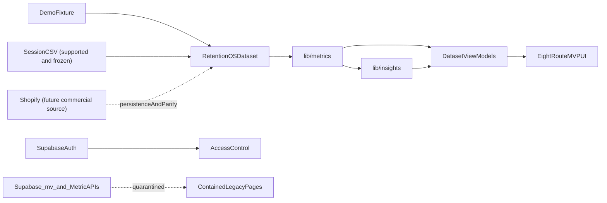

# RetentionOS Canonical Architecture

- **Status:** Current architecture source of truth
- **Audit:** Sprint 5U-A — documentation-only, non-destructive
- **Audited branch:** `agent/sprint-5ua-canonical-architecture-audit`
- **Audited commit:** `c3042f5d8d45b7247860640fcabd585edcdde582`
- **Audit date:** 2026-07-25
- **Initial working tree:** Clean
- **Runtime changes in this audit:** None

This document is the current repository-grounded architecture reference for routes, system boundaries, canonical versus legacy paths, and implementation state.

**Product boundary:** [PRODUCT_RECONCILIATION_BACKLOG.md](PRODUCT_RECONCILIATION_BACKLOG.md) §2.1 (do not redefine here).
**Execution sequence:** [PRODUCT_RECONCILIATION_BACKLOG.md](PRODUCT_RECONCILIATION_BACKLOG.md) §10.
**MVP presentation composition:** [VISIBLE_PRODUCT_BIBLE.md](VISIBLE_PRODUCT_BIBLE.md) (page ownership, analytical hierarchy, Signal/trust presentation — do not redefine here).
Agent routing: [AGENTS.md](../AGENTS.md). Historical audits remain evidence for the state they inspected but do not override this document.

## 1. Executive decisions

### 1.1 Canonical declaration

**Confirmed:** The retained MVP metric path is:

```text
demo fixture or saved session CSV
  → RetentionOSDataset
  → lib/metrics
  → dataset view models
  → command-centre UI
```

Evidence:
- `lib/data-source/dataset-types.ts::RetentionOSDataset` defines the common input contract.
- `lib/data-source/client-selected-source.ts::resolveCommandCentreDatasetSource` selects a valid session upload or the demo dataset.
- `lib/metrics/index.ts` exports the canonical calculators and view-model builders.
- The seven KPI clients import `resolveCommandCentreDatasetSource` and a `build*ViewModelFromDataset` function: `DashboardExecutive`, `CohortsPage`, `RetentionClient`, `LTVPage`, `AcquisitionPage`, `ProductsPage`, and `InsightsClient`.
- `components/data/DataPageRouteCoverage.tsx::buildCoverageRows` names the same eight-route surface and states that KPI routes use the same selected source.



**Confirmed:** `/insights` is a rules layer over the same dataset and metric functions. Evidence: `lib/insights/insights-view-model.ts::buildInsightsPageViewModelFromDataset` and `lib/insights/generate-diagnostic-insights.ts::buildDiagnosticInsightsBundle`.

**Confirmed:** `/data` is the source-control and ingestion workflow. Its client controls session uploads; its server page still builds demo audit metadata. Evidence: `components/data/CsvImportPreview.tsx`, `lib/data-source/browser-session.ts`, and `app/(protected)/data/page.tsx::DataPage`.

**Confirmed:** Supabase is not the metric source for the command-centre spine. It currently provides authentication and a parallel Shopify/API stack. Evidence: no `/api` fetch or Supabase import was found in the seven KPI route clients; `app/(protected)/dashboard/page.tsx::DashboardPage` uses Supabase only for the production session gate.

### 1.2 Operating contracts

- No new features may target quarantined routes, handlers, pipelines, or components.
- CSV remains a supported browser-session ingestion, QA, and fallback path. It is frozen against feature expansion in this program.
- Shopify remains the intended future primary commercial connection, but requires separately approved persistence, normalization, security, and metric-parity work before it can feed the canonical spine.
- Use **Revenue Durability Posture** (`Healthy`, `Mixed`, `Watch`). It is not a numeric score, composite index, or finance-grade durability metric. Evidence: `lib/metrics/revenue-durability-status.ts::evaluateRevenueDurabilityStatus` and `lib/metrics/metric-definitions.ts::revenue_durability_posture`.
- Core metric math belongs in `lib/metrics`; React renders view models.
- Demo and uploaded CSV inputs use the same metric engine. Mock data must not silently replace production-shaped empty states.

### 1.3 UTC calendar-month cohort contract

**Confirmed:**
- Cohort month is the UTC `YYYY-MM` of `Customer.firstOrderAt`.
- M+N is a calendar-month index offset, not elapsed 30-day windows.
- A customer is active at M+N when they have at least one qualifying order in that UTC month.
- The retention denominator remains the full acquisition cohort size.
- Revenue LTV is cumulative net merchandise revenue per cohort customer through the offset.
- Contribution LTV applies the same staircase using explicit order contribution or supplied margin assumptions.
- First-to-second within 90 days is a journey-time metric and is not interchangeable with Month+N activity.

Evidence: `lib/metrics/utils.ts::utcMonthKeyFromIso`, `calendarMonthIndexFromKey`, and `addMonthsToMonthKey`; `lib/metrics/retention.ts::calculateRetentionByCohort`; `lib/metrics/ltv.ts::calculateLTVByCohort`; `lib/metrics/repeat-purchase.ts::calculateFirstToSecondOrderConversion`.

## 2. Evidence and classification policy

### 2.1 Conclusion labels

- **Confirmed:** directly proven by repository evidence.
- **Inferred:** supported but not directly proven; reasoning is stated.
- **Unresolved:** insufficient evidence; disposition is **investigate** with a next verification step.

Earlier audits are leads, not evidence. Current counts, missing handlers, package usage, pipeline dispositions, and architecture conclusions were reproduced at the pinned commit.

### 2.2 Dispositions

- **Keep:** required by the active product, shared infrastructure, or a retained supporting workflow.
- **Quarantine:** retained in the repository but excluded from the canonical MVP path and all new feature development.
- **Investigate:** evidence is insufficient; the missing proof and next verification step are recorded.
- **Delete later:** no retained purpose or live dependency was found; removal still requires a separate approved sprint.

### 2.3 Reachability and consumer terms

Page reachability uses exactly one of: `primary navigation`, `directly linked`, `redirect target`, `redirected/contained`, `auth/system-only`, `direct URL only`, `unreachable/orphan`, or `unknown pending evidence`.

Consumer relationships are independent: `direct import`, `runtime fetch`, `navigation`, `redirect/middleware`, `test-only`, or `no consumer found`.

## 3. Reproducible audit baseline

### 3.1 Discovery methods

Run from the repository root at the pinned commit:

```powershell
git status --short --branch
git rev-parse HEAD
git ls-files -- "app/page.tsx" "app/**/page.tsx"
git ls-files -- "app/**/route.ts"
rg -n "fetch\(" app components lib
rg -n "resolveCommandCentreDatasetSource|build[A-Za-z]+ViewModelFromDataset" app lib
rg -n "import\(|require\(" --glob "*.{ts,tsx,js,mjs,cjs}" .
```

Focused repository searches then covered:
- literal `/api/*` fetch targets in tracked TypeScript/TSX;
- page navigation and redirects;
- `resolveCommandCentreDatasetSource` and `build*ViewModelFromDataset` consumers;
- `mv_*` reads and SQL definitions;
- package imports, wrappers, dynamic `import()`/`require()`, configuration, scripts, and build-time entries.

Exclusions: `.next`, generated output, `node_modules`, non-route backups, archived components that are not `page.tsx`, and non-Next files. Route groups such as `(protected)` do not appear in URLs.

### 3.2 Confirmed counts and discrepancy

| Artifact | Confirmed count | Reconciliation |
|---|---:|---|
| Page entries | 54 | 10 keep + 31 quarantine + 3 investigate + 10 delete later |
| Route/auth handlers | 20 | 2 keep + 10 quarantine + 4 investigate + 4 delete later |
| Missing literal fetch targets | 8 | Eight fetch URLs have no matching tracked `route.ts` |

**Discrepancy explained:** `git ls-files -- "app/**/page.tsx"` returns 53 because that pathspec omits root `app/page.tsx`. Adding `app/page.tsx` explicitly returns 54. `docs/route-audit.md` reported 50 pages in 2024; the current count is four higher, but this audit does not infer the historical delta without a commit-to-commit route diff.

## 4. Page route inventory

Each row records the complete evidence schema. `N/A` means the artifact has no metric responsibility. Reachability is derived from `components/app-sidebar.tsx::data.navMain` and `lib/mvp/demo-surface-guard.ts::getMvpContainmentRedirect`.

| # | Route | Role | Data source | Metric owner | Reachability | Consumer relationship | Mock/demo/prototype behavior | Reproducible evidence | Disposition |
|---:|---|---|---|---|---|---|---|---|---|
| 1 | `/acquisition` | Acquisition economics | Selected `RetentionOSDataset` | `lib/metrics/acquisition-view-model.ts` | primary navigation | navigation; direct import | Demo or saved session CSV; quality locks explicit | `app/(protected)/acquisition/page.tsx::AcquisitionPage` | Keep |
| 2 | `/cohorts/category` | Category cohort prototype | Missing `/api/metrics/category-cohorts` | React/API-local | redirected/contained | runtime fetch; redirect/middleware | API target absent | `app/(protected)/cohorts/category/page.tsx::CategoryCohortsPage` | Quarantine |
| 3 | `/cohorts/composition` | Composition prototype | Missing `/api/metrics/composition` | React/API-local | redirected/contained | runtime fetch; redirect/middleware | API target absent | `app/(protected)/cohorts/composition/page.tsx::CustomerCompositionPage` | Quarantine |
| 4 | `/cohorts` | Cohort economics and matrix | Selected `RetentionOSDataset` | `lib/metrics/cohort-view-model.ts`; `cohort-matrix.ts` | primary navigation | navigation; direct import | Demo or saved session CSV | `app/(protected)/cohorts/page.tsx::CohortsPage` | Keep |
| 5 | `/connect/klaviyo` | Klaviyo placeholder | None | N/A | redirected/contained | redirect/middleware; no consumer found | `ComingSoon` only | `app/(protected)/connect/klaviyo/page.tsx::ConnectKlaviyoPage` | Delete later |
| 6 | `/connect/shopify` | Shopify OAuth prototype | Supabase `shopify_connections` via handlers | N/A | redirected/contained | redirect/middleware; API redirect | Future path; not canonical ingestion | `app/(protected)/connect/shopify/page.tsx::ConnectShopifyPage` | Investigate |
| 7 | `/customer-intelligence/composition` | Customer composition prototype | Inline constants | React-local | redirected/contained | redirect/middleware; no retained consumer | Hard-coded lifecycle/geo/channel state | `app/(protected)/customer-intelligence/composition/page.tsx::CustomerCompositionPage` | Quarantine |
| 8 | `/customer-intelligence/profiles` | Profile prototype | Inline constants | React-local | redirected/contained | redirect/middleware; no retained consumer | Hard-coded profile state | `app/(protected)/customer-intelligence/profiles/page.tsx::CustomerProfilesPage` | Quarantine |
| 9 | `/customer-intelligence/segments` | Segment prototype | Inline constants | React-local | redirected/contained | redirect/middleware; no retained consumer | Hard-coded VIP/risk state | `app/(protected)/customer-intelligence/segments/page.tsx::CustomerSegmentsPage` | Quarantine |
| 10 | `/customers/list` | Customer table prototype | Supabase `customers` API | API-local | redirected/contained | runtime fetch; redirect/middleware | Legacy production-shaped UI | `app/(protected)/customers/list/page.tsx::CustomerListPage` | Quarantine |
| 11 | `/customers` | Customer overview prototype | `lib/demo-data/customers` or legacy fetch interception | React-local | redirected/contained | direct import; redirect/middleware | Separate demo-mode system | `app/(protected)/customers/page.tsx`; `app/(protected)/customers/CustomersClient.tsx::CustomersClient` | Quarantine |
| 12 | `/customers/profile` | Profile prototype | Missing `/api/customers/profile` | React/API-local | redirected/contained | runtime fetch; redirect/middleware | API target absent | `app/(protected)/customers/profile/page.tsx::CustomerProfilePage` | Quarantine |
| 13 | `/customers/segments` | Segment table prototype | Missing `/api/customers/segments` | React/API-local | redirected/contained | runtime fetch; redirect/middleware | API target absent | `app/(protected)/customers/segments/page.tsx::CustomerSegmentsPage` | Quarantine |
| 14 | `/dashboard` | Executive command centre | Selected `RetentionOSDataset`; Supabase session gate only | `lib/metrics/dashboard-view-model.ts` | primary navigation | navigation; direct import | Demo or saved session CSV | `app/(protected)/dashboard/page.tsx::DashboardPage`; `DashboardExecutive` | Keep |
| 15 | `/data` | Source, import, assumptions, QA | Demo fixture plus browser session CSV | `lib/metrics/data-view-model.ts`; import preview | primary navigation | navigation; direct import | Server audit VM is demo-anchored; client controls upload | `app/(protected)/data/page.tsx::DataPage`; `CsvImportPreview` | Keep |
| 16 | `/executive/exports` | Export prototype | Inline options | N/A | redirected/contained | redirect/middleware; no retained consumer | Export action is TODO | `app/(protected)/executive/exports/page.tsx::ExportsPage` | Quarantine |
| 17 | `/executive` | Redundant redirect stub | None | N/A | redirected/contained | redirect/middleware; no retained consumer | Client redirects to `/dashboard` | `app/(protected)/executive/page.tsx::ExecutivePage` | Delete later |
| 18 | `/executive/reconciliation` | Reconciliation prototype | Inline constants | React-local | redirected/contained | redirect/middleware; no retained consumer | Hard-coded reconciliation state | `app/(protected)/executive/reconciliation/page.tsx::DataReconciliationPage` | Quarantine |
| 19 | `/feedback` | Duplicate feedback prototype | Browser state only | N/A | redirected/contained | legacy navigation; redirect/middleware | Simulated submit via `FeedbackTool` | `app/(protected)/feedback/page.tsx::FeedbackPage`; `FeedbackTool::handleSubmit` | Quarantine |
| 20 | `/financials/forecasts` | Forecast placeholder | None | N/A | redirected/contained | redirect/middleware; no consumer found | `ComingSoon` only | `app/(protected)/financials/forecasts/page.tsx::ForecastsScenariosPage` | Delete later |
| 21 | `/financials/ltv-summary` | Duplicate LTV placeholder | None | N/A | redirected/contained | redirect/middleware; no consumer found | `ComingSoon` only | `app/(protected)/financials/ltv-summary/page.tsx::LTVSummaryPage` | Delete later |
| 22 | `/financials` | Financials placeholder | None | N/A | redirected/contained | redirect/middleware; no consumer found | `ComingSoon` only | `app/(protected)/financials/page.tsx::FinancialsPage` | Delete later |
| 23 | `/financials/revenue` | Revenue placeholder | None | N/A | redirected/contained | redirect/middleware; no consumer found | `ComingSoon` only | `app/(protected)/financials/revenue/page.tsx::RevenueIntelligencePage` | Delete later |
| 24 | `/guides` | Guides prototype | Mock `/api/guides/list` | API-local | redirected/contained | runtime fetch; redirect/middleware | Mock guide records and FilterDemo | `app/(protected)/guides/page.tsx::GuidesPage` | Quarantine |
| 25 | `/insights` | Diagnostic insights | Selected `RetentionOSDataset` | `lib/insights/insights-view-model.ts` | primary navigation | navigation; direct import | Deterministic rules; demo or saved session CSV | `app/(protected)/insights/page.tsx::InsightsPage`; `InsightsClient` | Keep |
| 26 | `/integrations` | Integration prototype | `lib/demo-data/integrations` | N/A | redirected/contained | direct import; redirect/middleware | Separate demo-mode state | `app/(protected)/integrations/page.tsx`; `app/(protected)/integrations/IntegrationsClient.tsx::IntegrationsClient` | Quarantine |
| 27 | `/ltv` | LTV ladders | Selected `RetentionOSDataset` | `lib/metrics/ltv-view-model.ts` | primary navigation | navigation; direct import | Demo or saved session CSV | `app/(protected)/ltv/page.tsx::LTVPage` | Keep |
| 28 | `/product-economics/concentration` | Pareto prototype | Inline `mockData` | React-local | redirected/contained | redirect/middleware; no retained consumer | Hard-coded mock | `app/(protected)/product-economics/concentration/page.tsx::ConcentrationCurvePage` | Quarantine |
| 29 | `/product-economics/discounts` | Discount prototype | Inline constants | React-local | redirected/contained | redirect/middleware; no retained consumer | Hard-coded mock | `app/(protected)/product-economics/discounts/page.tsx::DiscountUsagePage` | Quarantine |
| 30 | `/product-economics/performance` | Product performance prototype | Mock `/api/products/performance` | API-local | redirected/contained | runtime fetch; redirect/middleware | Hard-coded API products | `app/(protected)/product-economics/performance/page.tsx::ProductPerformancePage` | Quarantine |
| 31 | `/products/cross-sell` | Cross-sell prototype | Missing `/api/products/cross-sell` | React/API-local | redirected/contained | runtime fetch; redirect/middleware | API target absent | `app/(protected)/products/cross-sell/page.tsx::CrossSellAnalysisPage` | Quarantine |
| 32 | `/products` | First-product customer quality | Selected `RetentionOSDataset` | `lib/metrics/product-quality-view-model.ts` | primary navigation | navigation; direct import | Demo or saved session CSV; line-item locks explicit | `app/(protected)/products/page.tsx::ProductsPage` | Keep |
| 33 | `/products/performance` | Product table prototype | Mock `/api/products/performance` | API-local | redirected/contained | runtime fetch; redirect/middleware | Hard-coded API products | `app/(protected)/products/performance/page.tsx::ProductPerformancePage` | Quarantine |
| 34 | `/products/replenishment` | Replenishment prototype | Missing `/api/products/replenishment` | React/API-local | redirected/contained | runtime fetch; redirect/middleware | API target absent | `app/(protected)/products/replenishment/page.tsx::ReplenishmentMetricsPage` | Quarantine |
| 35 | `/reports` | Report prototype | `lib/demo-data/reports` | N/A | redirected/contained | direct import; redirect/middleware | Separate demo-mode state | `app/(protected)/reports/page.tsx`; `app/(protected)/reports/ReportsClient.tsx::ReportsClient` | Quarantine |
| 36 | `/retention-ltv/curves` | Legacy retention curves | `/api/metrics/cohorts` → `mv_cohorts`/dummy | React/UI aggregation | redirected/contained | runtime fetch; redirect/middleware | Dev dummy fallback and UI transforms | `app/(protected)/retention-ltv/curves/page.tsx::RetentionCurvesPage` | Quarantine |
| 37 | `/retention-ltv/decisions` | Legacy diagnosis synthesis | Cohorts and repeat APIs | `lib/diagnosis` | redirected/contained | runtime fetch; redirect/middleware | Production-shaped legacy APIs | `app/(protected)/retention-ltv/decisions/page.tsx::DecisionsPage` | Quarantine |
| 38 | `/retention-ltv/ltv-cohorts` | Legacy LTV aggregation | `/api/metrics/cohorts` | React/UI aggregation | redirected/contained | runtime fetch; redirect/middleware | Client dummy fallback and normalization | `app/(protected)/retention-ltv/ltv-cohorts/page.tsx::CLRLTVCohortsPage` | Quarantine |
| 39 | `/retention-ltv/repeat-rates` | Legacy repeat funnel | `/api/metrics/repeat-purchases` | Shared repeat helper plus legacy UI | redirected/contained | runtime fetch; redirect/middleware | API demo flag; UI transformations | `app/(protected)/retention-ltv/repeat-rates/page.tsx::RepeatPurchaseRatesPage`; `app/(protected)/retention-ltv/repeat-rates/RepeatPurchaseRatesContent.tsx::RepeatPurchaseRatesContent` | Quarantine |
| 40 | `/retention-ltv/revenue-cohorts` | Legacy revenue cohort UI | `/api/metrics/cohorts` | React/UI aggregation | redirected/contained | runtime fetch; redirect/middleware | API/inline dummy and UI aggregation | `app/(protected)/retention-ltv/revenue-cohorts/page.tsx::RevenueCohortsPage` | Quarantine |
| 41 | `/retention/churn` | Churn prototype | Missing `/api/retention/churn` | React/API-local | redirected/contained | runtime fetch; redirect/middleware | API target absent | `app/(protected)/retention/churn/page.tsx::ChurnRiskPage` | Quarantine |
| 42 | `/retention/curve` | Curve prototype | Mock `/api/retention/curve` | API-local | redirected/contained | runtime fetch; redirect/middleware | Hard-coded API curves | `app/(protected)/retention/curve/page.tsx::RetentionCurvePage` | Quarantine |
| 43 | `/retention` | Retention and repeat | Selected `RetentionOSDataset` | `lib/metrics/retention-view-model.ts` | primary navigation | navigation; direct import | Demo or saved session CSV | `app/(protected)/retention/page.tsx::RetentionPage`; `RetentionClient` | Keep |
| 44 | `/retention/reactivation` | Reactivation prototype | Missing `/api/retention/reactivation` | React/API-local | redirected/contained | runtime fetch; redirect/middleware | API target absent | `app/(protected)/retention/reactivation/page.tsx::ReactivationPage` | Quarantine |
| 45 | `/roadmap` | Historical roadmap page | Inline constants | N/A | redirected/contained | redirect/middleware; no retained consumer | Static prototype | `app/(protected)/roadmap/page.tsx::RoadmapPage` | Quarantine |
| 46 | `/scenarios` | Scenario stub | None | N/A | redirected/contained | redirect/middleware; no retained consumer | Future placeholder | `app/(protected)/scenarios/page.tsx::ScenariosPage` | Quarantine |
| 47 | `/segments` | Segment placeholder | None | N/A | redirected/contained | redirect/middleware; no consumer found | `ComingSoon` only | `app/(protected)/segments/page.tsx::SegmentsPage` | Delete later |
| 48 | `/settings/feedback` | Feedback page prototype | Browser state only | N/A | direct URL only | no navigation consumer found | Simulates submit, logs payload, then claims success; mailto is real | `app/(protected)/settings/feedback/page.tsx::FeedbackPage`; `FeedbackTool::handleSubmit` | Delete later |
| 49 | `/settings/integrations` | Credential-status prototype | Inline `configItems` | N/A | direct URL only | no navigation consumer found | Fabricated statuses/timestamps; all action buttons inert | `app/(protected)/settings/integrations/page.tsx::configItems` | Delete later |
| 50 | `/settings` | Account/settings prototype and demo-mode control | Auth endpoint merged with `DEFAULT_SETTINGS` | N/A | primary navigation | navigation; runtime fetch | Fabricated user/team/RLS/usage fallbacks, hard-coded API key, inert controls; demo toggle is local | `app/(protected)/settings/page.tsx::DEFAULT_SETTINGS`; `SettingsPage::fetchSettings` | Investigate |
| 51 | `/sync` | Shopify sync prototype | Shopify/Supabase handlers | N/A | redirected/contained | runtime fetch; legacy navigation | Includes destructive dummy-data action | `app/(protected)/sync/page.tsx::SyncPage` | Investigate |
| 52 | `/login` | Supabase login | Supabase Auth | N/A | auth/system-only | redirect target; direct import | Real auth UI; dev route auth bypass remains separate | `app/login/page.tsx::LoginPage`; `LoginClient` | Keep |
| 53 | `/verify` | Supabase OTP verification | Supabase Auth | N/A | auth/system-only | auth navigation; direct import | Real auth UI | `app/verify/page.tsx::VerifyPage`; `VerifyClient` | Keep |
| 54 | `/` | Environment-dependent root placeholder | None | N/A | direct URL only | no consumer found | Development redirects to `/dashboard`; production renders “Tailwind is working” and an inert Continue button | `app/page.tsx::Home` | Delete later |

### 4.1 Page reconciliation

| Reachability | Count |
|---|---:|
| Primary navigation | 9 |
| Direct URL only | 3 |
| Auth/system-only | 2 |
| Redirected/contained | 40 |
| **Total** | **54** |

| Disposition | Count |
|---|---:|
| Keep | 10 |
| Quarantine | 31 |
| Investigate | 3 |
| Delete later | 10 |
| **Total** | **54** |

### 4.2 Root-page reassessment

**Confirmed:** `app/page.tsx::Home` redirects to `/dashboard` only when `NODE_ENV === "development"`. In production it renders a Tailwind test/placeholder screen whose `Continue` button has no link, form action, or event handler. No retained production purpose or consumer was found. Its disposition is therefore **Delete later**, not Keep; removal or replacement still requires a separate approved sprint.

## 5. Handler inventory

Each row records the complete evidence schema. API handlers bypass page containment because `middleware.ts::middleware` returns early for `/api`.

| # | Endpoint | Role | Data source | Metric owner | Reachability | Consumer relationship | Mock/demo/prototype behavior | Reproducible evidence | Disposition |
|---:|---|---|---|---|---|---|---|---|---|
| 1 | `GET /api/customers/list` | Customer query API | Supabase `customers` | API-local | direct URL only | runtime fetch from contained customer page | Production-shaped legacy endpoint | `app/api/customers/list/route.ts::GET` | Quarantine |
| 2 | `GET /api/dashboard/metrics` | Legacy dashboard metrics | Supabase `customers`, `orders`, connections | API-local calculations | direct URL only | runtime fetch from orphan dashboard | Dummy metrics when data absent | `app/api/dashboard/metrics/route.ts::GET`; `generateDummyMetrics` | Quarantine |
| 3 | `POST /api/dev/generate-dummy-data` | Tenant seed/reset | Supabase service client | N/A | direct URL only | no consumer found | Destructive development data; production guard | `app/api/dev/generate-dummy-data/route.ts::POST`; `assertDestructiveDevApiAllowed` | Delete later |
| 4 | `GET /api/guides/list` | Guide-list API | Inline `mockGuides` | N/A | direct URL only | runtime fetch from contained guides page | Entire payload hard-coded | `app/api/guides/list/route.ts::GET`; `mockGuides` | Quarantine |
| 5 | `GET /api/integrations/status` | Integration-status prototype | Supabase connection plus inline list | N/A | direct URL only | no consumer found | Partially fabricated integration statuses | `app/api/integrations/status/route.ts::GET` | Delete later |
| 6 | `GET /api/metrics/cohorts` | Legacy cohort API | Supabase `mv_cohorts` | SQL/API-local | direct URL only | runtime fetch from five contained pages | Development dummy fallback | `app/api/metrics/cohorts/route.ts::GET`; `generateDummyCohorts` | Quarantine |
| 7 | `GET/POST /api/metrics/kpis` | Legacy KPI read/refresh | Supabase `mv_kpis` | SQL/API-local | direct URL only | runtime fetch from orphan dashboards | Mock KPI fallback | `app/api/metrics/kpis/route.ts::GET`; `POST` | Quarantine |
| 8 | `GET /api/metrics/repeat-purchases` | Legacy repeat API adapter | Supabase `customers` and `orders` | `lib/metrics::computeRepeatPurchaseApiMetrics` | direct URL only | runtime fetch from contained repeat/decisions pages | Explicit development demo/empty state | `app/api/metrics/repeat-purchases/route.ts::GET` | Quarantine |
| 9 | `GET /api/metrics/segments` | Legacy segment API | Supabase `mv_customer_segments` | SQL/API-local | direct URL only | no matching page fetch | Production-shaped legacy endpoint | `app/api/metrics/segments/route.ts::GET` | Quarantine |
| 10 | `GET /api/products/performance` | Product-performance prototype | Inline `mockProducts` | API-local | direct URL only | runtime fetch from two contained pages | Entire payload hard-coded | `app/api/products/performance/route.ts::GET`; `mockProducts` | Quarantine |
| 11 | `GET /api/reports/summary` | Report-summary prototype | Inline `mockReportData` | N/A | direct URL only | no consumer found | Entire payload hard-coded | `app/api/reports/summary/route.ts::GET`; `mockReportData` | Delete later |
| 12 | `GET /api/retention/analysis` | Retention-analysis prototype | Inline `mockRetentionData` | API-local | direct URL only | no consumer found | Entire payload hard-coded | `app/api/retention/analysis/route.ts::GET`; `mockRetentionData` | Delete later |
| 13 | `GET /api/retention/curve` | Retention-curve prototype | Inline `mockRetentionData` | API-local | direct URL only | runtime fetch from contained curve page | Entire payload hard-coded | `app/api/retention/curve/route.ts::GET`; `mockRetentionData` | Quarantine |
| 14 | `GET /api/settings/user` | Authenticated settings prototype | Supabase auth identity/account lookup plus inline `userSettings` | N/A | direct URL only | runtime fetch from primary-nav settings page | Only id/email/name come from auth; preferences, `pro` plan, created/login times are defaulted or fabricated; response shape does not match page contract; response sets a public cache header | `app/api/settings/user/route.ts::GET`; `userSettings` | Investigate |
| 15 | `GET /api/shopify/auth` | Shopify OAuth initiation | Supabase session plus environment config | N/A | direct URL only | contained connect page / redirects | Future architecture; not canonical ingestion | `app/api/shopify/auth/route.ts::GET` | Investigate |
| 16 | `GET /api/shopify/callback` | Shopify token callback | Shopify response and Supabase connections | N/A | direct URL only | OAuth redirect | Future architecture; not canonical ingestion | `app/api/shopify/callback/route.ts::GET` | Investigate |
| 17 | `POST /api/sync/dummy-data` | Tenant seed/reset | Supabase service client | N/A | direct URL only | runtime fetch from contained sync page | Destructive development data; production guard | `app/api/sync/dummy-data/route.ts::POST`; `assertDestructiveDevApiAllowed` | Quarantine |
| 18 | `POST /api/sync/shopify` | Shopify-to-Supabase sync | Shopify API; Supabase customer/order tables | N/A | direct URL only | runtime fetch from contained sync page | Future architecture; no canonical dataset adapter | `app/api/sync/shopify/route.ts::POST` | Investigate |
| 19 | `GET /auth/callback` | Supabase auth callback | Supabase Auth | N/A | auth/system-only | auth redirect | Real auth handler | `app/auth/callback/route.ts::GET` | Keep |
| 20 | `POST /auth/signout` | Supabase server-side signout | Supabase Auth | N/A | auth/system-only | no active UI consumer; only repository fetch is in orphan `Header::handleLogout` | Valid auth handler; current `NavUser` logout item is inert | `app/auth/signout/route.ts::POST`; `app/components/Header.tsx::handleLogout`; `app/(protected)/layout.tsx::ProtectedLayout`; `components/nav-user.tsx::NavUser` | Keep |

**Signout consumer correction:** `app/components/Header.tsx::handleLogout` contains the repository's only `/auth/signout` fetch, but no import or render consumer for `Header` was found. The active protected layout renders `components/app-sidebar.tsx::AppSidebar`, whose `NavUser` displays “Log out” without a form, action, click handler, fetch, or route invocation. `/auth/signout` therefore has no active UI consumer. Its **Keep** disposition is based solely on its valid retained authentication/control-plane role (`POST` calls `supabase.auth.signOut`, clears SSR cookies, and redirects to `/login`), not current UI wiring.

### 5.1 Handler reconciliation

| Disposition | Count |
|---|---:|
| Keep | 2 |
| Quarantine | 10 |
| Investigate | 4 |
| Delete later | 4 |
| **Total** | **20** |

### 5.2 Confirmed fetch targets without handlers

The discovery search matched literal `fetch("/api/...")` and template-literal equivalents in tracked TSX, then compared targets with the 20 tracked handlers.

| Missing target | Fetch consumer |
|---|---|
| `/api/customers/profile` | `app/(protected)/customers/profile/page.tsx` |
| `/api/customers/segments` | `app/(protected)/customers/segments/page.tsx` |
| `/api/metrics/category-cohorts` | `app/(protected)/cohorts/category/page.tsx` |
| `/api/metrics/composition` | `app/(protected)/cohorts/composition/page.tsx` |
| `/api/products/cross-sell` | `app/(protected)/products/cross-sell/page.tsx` |
| `/api/products/replenishment` | `app/(protected)/products/replenishment/page.tsx` |
| `/api/retention/churn` | `app/(protected)/retention/churn/page.tsx` |
| `/api/retention/reactivation` | `app/(protected)/retention/reactivation/page.tsx` |

These are contained legacy consumers. They are not requirements to create new handlers.

### 5.3 Settings control-plane reassessment

| Artifact | Confirmed behavior | Trust assessment | Disposition and rationale |
|---|---|---|---|
| `/settings` | `SettingsPage::fetchSettings` merges the API response into `DEFAULT_SETTINGS`. Because the API response does not provide the page's `user`, `team`, `rls_settings`, or `account.usage` shape, Alex Parker, the demo team, enabled RLS, Pro usage, and workspace counts are displayed from defaults. The API key string and multiple controls are hard-coded/inert. The local demo-mode toggle is functional. | Primary-navigation UI prototype, not trustworthy live account/team/security state. | **Investigate.** Possible retained purpose is a future account shell and current local demo-mode control. Missing proof: approved settings requirements, persisted schema, truthful empty/error states, and auth policy. Next: define a page/API contract and verify each displayed field against persistence before retaining it. |
| `/settings/feedback` | Renders `FeedbackTool`; `handleSubmit` waits one second, logs to the console, clears the form, and shows a false success message. The support mailto link is real. No navigation consumer was found. | UI prototype, not a live feedback submission workflow. | **Delete later.** No unique retained purpose was found beyond the separately mounted floating `FeedbackTool`; removal requires a separate sprint. |
| `/settings/integrations` | `configItems` hard-codes “Verified”, “Needs review”, “Missing”, and timestamps. Reset, add, reveal, and domain buttons have no handlers. No navigation consumer was found. | Credential-status prototype, not observed configuration or integration state. | **Delete later.** No live state or retained consumer was found; future Shopify work must not treat this page as evidence of configuration. |
| `/api/settings/user` | Authenticates the request and reads Supabase user id/email/name, but `userSettings` hard-codes preferences, Pro plan, dashboard layout, and time-derived account dates. Its response shape does not match `SettingsPage`'s expected shape, and `GET` sets `Cache-Control: public, max-age=300, stale-while-revalidate=600`. | Partly live identity wrapped in fabricated settings/account state with unresolved cache/privacy semantics. | **Investigate.** Missing proof: persisted settings model, stable response contract, cache/privacy policy, and retained page requirements. Next: define a typed contract and map every returned field to an authoritative source. |

## 6. Metric-pipeline duplication matrix

| Domain | Canonical implementation and consumers | SQL/API/page duplicate | Confirmed difference | Disposition |
|---|---|---|---|---|
| Cohort assignment/economics | `utils.ts::utcMonthKeyFromIso`; `cohorts.ts::calculateCohorts`; cohort/dashboard VMs | `mv_cohorts`; cohorts API; retention-LTV pages | UTC key + net merchandise vs SQL `DATE_TRUNC` + `total_price` | Keep TS; quarantine duplicate |
| Month+N retention | `retention.ts::calculateRetentionByCohort`; cohort/retention/dashboard/insights | `mv_cohorts`, `mv_retention_periods`; curves pages | Calendar index vs `EXTRACT(month FROM AGE(...))`; engine fractional rate vs SQL percent | Keep TS; quarantine duplicate |
| Repeat purchase | `repeat-purchase.ts::calculateRepeatPurchaseRate` | `mv_kpis`; repeat API delegates to `computeRepeatPurchaseApiMetrics` | SQL paid-order filter; API filter semantics | Keep TS; quarantine API consumer path |
| First-to-second 90d | `repeat-purchase.ts::calculateFirstToSecondOrderConversion` | No second implementation found | Journey days intentionally differ from Month+N | Keep |
| Revenue LTV | `ltv.ts::calculateLTVByCohort`; LTV/cohort/dashboard/insights | Cohort API + `retention-ltv/ltv-cohorts` UI aggregation | Engine cumulative net revenue/customer; legacy derives from SQL totals | Keep TS; quarantine duplicate |
| Contribution LTV | `ltv.ts::calculateLTVByCohort`; `utils.ts::orderContribution` | No `mv_*` equivalent found | Engine requires explicit contribution or assumptions | Keep |
| CAC / LTV:CAC / payback | `acquisition.ts`; acquisition/dashboard VMs | No SQL/API equivalent found | Canonical path labels actual/estimated/unavailable spend | Keep |
| First-product quality | `product-quality.ts`; products/dashboard VMs | Products performance mock API/pages | Customer durability by first product vs mock sales KPIs | Keep TS; quarantine mock path |
| Revenue Durability Posture | `revenue-durability-status.ts::evaluateRevenueDurabilityStatus` | No SQL/API equivalent found | One heuristic evaluator; no numeric score | Keep |
| Diagnostic insights | `lib/insights`; insights VM | `lib/diagnosis` + retention-LTV decisions page | Canonical rules use selected dataset; legacy synthesizes API payloads | Keep rules; quarantine diagnosis path |
| Executive KPIs | `dashboard-view-model.ts::buildDashboardExecutiveViewModelFromDataset` | `mv_kpis`, KPI API, dashboard metrics API, three orphan dashboard components | Net revenue and canonical retention constructs vs `total_price`, inline heuristics, dummy fallbacks | Keep VM; quarantine duplicates |
| Customer segments | No canonical metric engine module | `mv_customer_segments`; segments API; missing page endpoint | No retained MVP requirement proven | Quarantine |

### 6.1 Material SQL/API drift

**Confirmed:**
- `supabase/migrations/006_create_metric_views.sql::mv_cohorts` uses `DATE_TRUNC`, `total_price`, paid orders, and `EXTRACT(month FROM AGE(...))`.
- The TS engine uses explicit UTC month keys, net merchandise revenue (`grossRevenue - discounts - refunds`), and calendar-month indices.
- `middleware.ts::middleware` exits early for `/api`, so page containment does not contain direct API calls.
- `middleware.ts::protectedPaths` lists only `/dashboard`, `/sync`, and `/connect`; uniform production auth for all retained routes is not proven.

No SQL migration is changed or reinterpreted by this audit.

## 7. Dependency inventory

Package dispositions reflect direct imports, wrapper consumers, global dynamic-import/`require` search, `package.json` scripts, `next.config.ts`, `eslint.config.mjs`, `postcss.config.mjs`, and `app/globals.css`.

Package usage statements below are **Confirmed**. **Investigate** is used only where retained architectural intent remains unresolved.

| Package(s) | Evidence | Disposition |
|---|---|---|
| `next`, `react`, `react-dom` | Framework and all active pages | Keep |
| `@supabase/ssr`, `@supabase/supabase-js` | Auth, dashboard gate, settings, future Shopify stack | Keep |
| `@radix-ui/react-*` | UI wrappers consumed by active sidebar, settings, data, and auth | Keep |
| `class-variance-authority`, `clsx`, `tailwind-merge` | `components/ui/*` and `lib/utils.ts` | Keep |
| `lucide-react` | `components/app-sidebar.tsx` and active route components | Keep |
| `input-otp` | `app/verify/VerifyClient.tsx` via input wrapper | Keep |
| `cmdk`, `motion`, `nanoid` | `FilterDemo` chain is currently compiled and rendered by primary-navigation `/settings`; package Keep records current technical dependency, not approval of the settings prototype | Keep |
| `@tanstack/react-table` | Type use in `lib/filters/types.ts`; consumers are contained legacy pages | Quarantine |
| `@tremor/react` | Chart wrappers consumed by contained legacy chart pages | Quarantine |
| `react-day-picker` | DateRangePicker → FilterBar → contained legacy pages | Quarantine |
| `recharts` | Direct use in retention-LTV pages and legacy chart wrappers; no retained spine import found | Quarantine |
| `@carbon/icons-react` | Only orphan `SidebarLayout`/`RetentionOSSidebar`; no import, config, script, or dynamic consumer found | Delete later |
| `typescript`, `eslint`, `eslint-config-next`, `@eslint/eslintrc`, `@types/*` | Package scripts and `eslint.config.mjs` | Keep |
| `tailwindcss`, `@tailwindcss/postcss`, `tw-animate-css` | `postcss.config.mjs` and `app/globals.css` | Keep |

**Correction to earlier evidence:** `cmdk`, `motion`, and `nanoid` are not legacy-only at this commit because `app/(protected)/settings/page.tsx::SettingsPage` renders `FilterDemo`.

### 7.1 Internal architectural dependencies

| System | Evidence | Disposition |
|---|---|---|
| `lib/types`, `lib/demo`, `lib/import`, `lib/data-source`, `lib/metrics`, `lib/insights`, `lib/mvp`, `components/mvp` | Canonical path and active imports | Keep |
| `lib/diagnosis`, `lib/demo-data`, `lib/filters`, `components/charts` | Contained legacy consumers | Quarantine |
| `mv_*` and non-shared legacy metric APIs | No retained spine consumer | Quarantine |
| `lib/database.ts`, `lib/shopifyClient.ts`, Shopify OAuth/sync | Future commercial path exists, but canonical adapter/security/parity proof is absent | Investigate |
| `lib/demo-mode/context.tsx` | Provider wraps retained layout and settings, but overlaps selected-source model | Investigate |
| `REDHomePage`, `PremiumDashboard`, `DashboardClient` | No imports found; superseded by `DashboardExecutive` | Delete later |
| `sidebar-layout.tsx`, `sidebar-component.tsx`, `hierarchical-sidebar.tsx`, `clean-sidebar.tsx` | No active layout imports found | Delete later |
| `app/api/dev/generate-dummy-data/route.ts` | Duplicate destructive seed implementation; no consumer found | Delete later |

## 8. Investigate register

| Artifact | Missing proof | Next read-only verification |
|---|---|---|
| `/connect/shopify`, `/sync`, Shopify handlers and clients | Approved future security, tenant persistence, canonical normalization, and metric parity contract | Trace Shopify payload → Supabase schema, review token handling/RLS, and design a `RetentionOSDataset` adapter before any revival |
| Production auth policy | Whether all command-centre routes are intentionally public-demo or should require sessions | Confirm product policy, then map it against `middleware.ts::protectedPaths` and page-level gates |
| `/settings` and `/api/settings/user` | Approved retained settings purpose, persisted field sources, compatible response contract, truthful fallback behavior, and auth/cache policy | Define a typed source-to-screen settings contract; verify every displayed field against an authoritative store and fail closed when unavailable |
| `lib/demo-mode/context.tsx` | Whether fetch interception remains a retained settings feature or should yield to selected-source semantics | Inventory runtime behavior under `/settings` and all provider consumers in a separate cleanup sprint |
| Supabase row types vs canonical types | No adapter proves connected data can enter the canonical engine without semantic loss | Define field-level mapping and parity fixture; do not use `mv_*` output as the oracle |

## 9. Documentation disposition

| Document | Role after 5U-A | Disposition |
|---|---|---|
| `docs/RETENTIONOS_ARCHITECTURE.md` | Current architecture source of truth | Keep |
| `docs/METRIC_CONTRACTS.md` | Canonical source-to-screen metric contracts (Sprint 5U-B) | Keep |
| `README.md` | Current project entry point; links here | Keep |
| `docs/agent/SPRINT_RUNBOOK.md` | Current operating workflow; links here | Keep |
| `RETENTIONOS_UPLOADED_DATA_MVP_CHECKPOINT.md` | Historical upload milestone and supporting CSV detail | Keep |
| `docs/agent/METRIC_ENGINE_INVENTORY.md` | Historical Sprint A–E inventory | Quarantine |
| `docs/route-audit.md` | Historical 2024 route audit | Quarantine |
| `docs/active-metrics-map.md` | Historical RED dashboard / legacy metric map | Quarantine |
| `MVP_STATUS.md` | Pre-restart historical status | Quarantine |
| `RETENTIONOS_RESTART_AUDIT_V2.md` | Historical six-route restart comparison | Quarantine |

## 10. Current program state

**Metric foundation:** **METRIC_FOUNDATION_CLOSED** (contracted MetricId set remains 22; formula ledger in [`METRIC_CONTRACTS.md`](./METRIC_CONTRACTS.md)).

**Current execution sequence** is owned by [`PRODUCT_RECONCILIATION_BACKLOG.md`](PRODUCT_RECONCILIATION_BACKLOG.md) §10 — do not duplicate the full sequence here. After documentation alignment (`DOC-AGENT-ALIGN`), next shared-system work is `6A-SIGNAL` → `6A-MATRIX` → `6A-PROVENANCE`, then 6B page upgrades, later 6C consolidation, and later PRE6D / 6D production Shopify ingestion.

**Still deferred / not live on the canonical spine:** production Shopify ingestion; channel-quality engine; numerical 0–100 Revenue Durability Score; Signal/Matrix/Provenance shared UI layer; 6B analytical page upgrades. Demo/CSV and fixture adapter parity are not production Shopify connectivity.

Route/API behavior changes, migrations, dependency removal, and legacy deletion require separately approved sprints.

## 11. Audit validation contract

For 5U-A:
- review `git status`, `git diff --stat`, `git diff --check`, and the complete documentation diff;
- rerun page/handler discovery and fetch-to-handler reconciliation;
- confirm all 54 pages and 20 handlers appear exactly once;
- confirm disposition and reachability totals reconcile;
- confirm every investigate item has a proof gap and next step;
- confirm only the documentation allowlist changed;
- do not run lint, typecheck, tests, or build because runtime source is unchanged.
